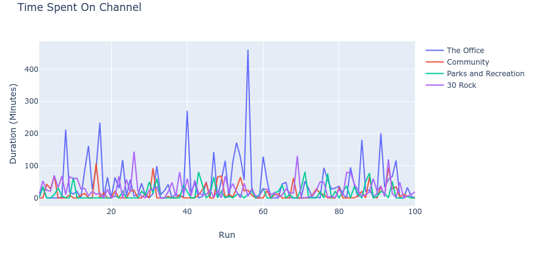
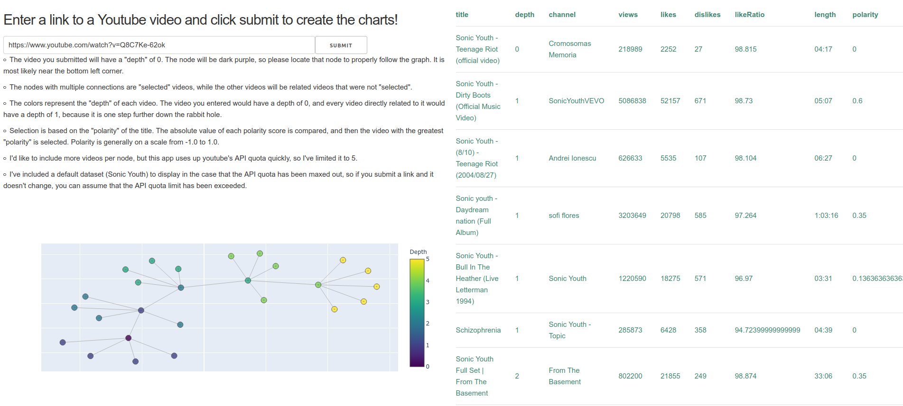
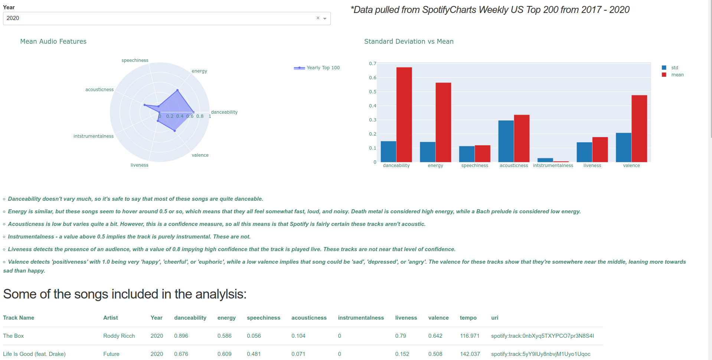
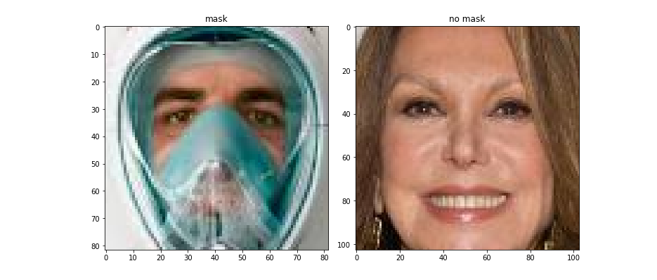
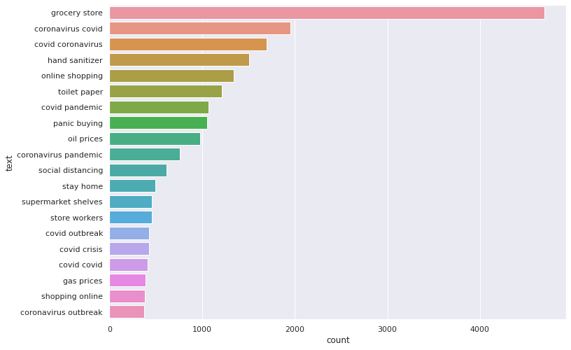
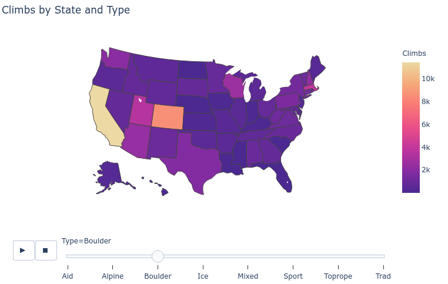

# Cam's Portfolio
[The YouTube Presence of The Office, Parks & Rec, Community, and 30 Rock](https://cameron-pudney.medium.com/the-youtube-presence-of-the-office-parks-rec-community-and-30-rock-7003bca79b8d)
+ Scraped data from YouTube using Selenium to simulate how users might click through different video options
+ Fed the scraped data into YouTube API in order to gather information about Views, Comments, Likes, Dislikes
+ Compared the ability of each show to keep viewers on their respective official channels for longest amount of time
+ The Office outperformed the other three shows in all explored metrics, with 30 Rock being second best

[YouTube Rabbit Hole Visualization](https://andamovie.herokuapp.com/dashboard/)
+ Created an interactive Plotly Dash visualization in Flask  where users enter a link to a YouTube video and a Kamada-Kawai layout graph is generated to picture a  possible “rabbit hole” a YouTube viewer could enter
+ Graph nodes display information about each video such as title polarity, views, likes, length, channel
+ Dashboard also has means and standard deviations of Views, Likes, Length for videos, deployed to Heroku

[Has Quarantine Changed America's Taste In Music?](https://cameron-pudney.medium.com/has-quarantine-changed-americas-taste-in-music-b622e94a1f5d)
+ Gathered data from Spotify using spotipy and Selenium to download popularity charts from SpotifyCharts
+ Compared audio features from top songs of the past few years to see if quarantine affected American music taste
+ Created interactive dashboard using Plotly and Dash for visualizations, deployed to Heroku. [Dashboard](https://seafoam-guitar.herokuapp.com/dashboard/)
+ Quarantine hasn’t had much of an effect on American music taste, but acoustic songs may be gaining popularity

[Mask Detection: Simple CNN vs Xception](https://www.kaggle.com/campudney/mask-detection-simple-cnn-vs-xception/)
+ Trained a convolutional neural net on a set of 12k images of people either wearing or not wearing a mask
+ Compared performance of a simple convolutional network  versus  a model using Xception’s ImageNet weights
+ Performed data augmentation in real-time using Tensorflow’s ImageDataGenerators to reduce overfitting
+ After 30 epochs of training with an Adam optimizer and binary cross entropy loss, the CNN outperformed Xception
+ Final model scores a 99% training accuracy, 99% validation accuracy, and a 98% test accuracy

[Covid-19 Tweets Sentiment Classification](https://cameron-pudney.medium.com/covid-19-tweets-sentiment-classification-f975b6f4a81c)
+ Tested multiple models and NLP techniques to compare classification accuracy of tweets with ‘covid19’ hashtag
+ Models included Support Vector Machine, Logistic Regression, Naive Bayes, Random Forest Classifier, BERT
+ Utilized NLP techniques such as Term Frequency Inverse Document Frequency, Stemming, and Lemmatization
+ Combinations of models and techniques compared using accuracies generated from 10-fold cross validation
+ Support Vector Machine using Term Frequency Inverse Document Frequency was the best ‘traditional’ model and yielded an 80% percent accuracy on training data and 79% accuracy on testing data
+ BERT trained on the tweets boasted an 85% accuracy on testing data after minimal  hyperparameter tuning

[Rock Climbing Routes In The US](https://www.kaggle.com/campudney/rock-climbing-routes-in-the-us)
+ Created visualizations of rock climbing routes using data scraped from MountainProject with BeautifulSoup4
+ Plotly choropleth map displays number of climbing areas and amounts of different types of climbing by state
+ Animated choropleth map allows user to select type of climbing to be displayed
+ California and Colorado have the most routes, but Massachusetts and Wisconsin have more than expected
+ [Final visualizations found here](https://www.kaggle.com/campudney/rock-climbing-routes-in-the-us)
+ [All code for scraping found here](https://github.com/cpud/climb-plotly/blob/master/final2.ipynb)

